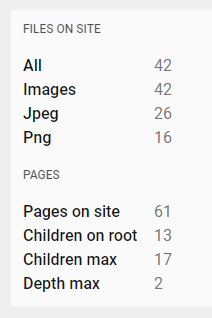

# Kirby Panel Stats

- **Version:** 0.1 beta
- **Requirement:** Kirby 3
- [Changelog](docs/changelog.md)
- [Disclaimer](https://devonera.se/docs/disclaimer/?user=jenstornell&plugin=kirby-panel-stats)
- [Donate](https://devonera.se/docs/donate/?user=jenstornell&plugin=kirby-panel-stats)

## Screenshot



## Usage

Put the code below into your blueprint. It's a field.

```text
panelstats:
  type: panelstats
```